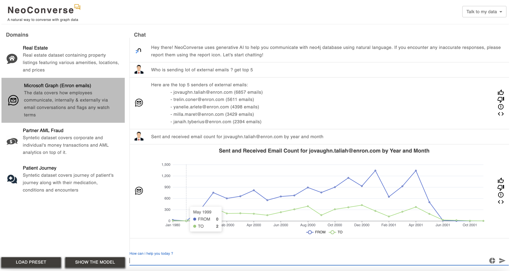

# NeoConverse
A GenAI copilot experience for your neo4j database



NeoConverse allows you to interact with your data in neo4j graph database in plain english, It provides a chat experience and enables users add your own neo4j database and interact with it

# **Getting Started**

You can get started with NeoConverse in one of the below two ways

- From a web browser by visiting [link]https:neoconverse.graphapp.io
- For On-Prem installation, you can clone the repo and build as follow 

## **On-Prem Installation guide**

### **Cloning**

Clone the github repo
```
https://github.com/neo4j-labs/neoconverse.git
```
The latest code is available in `master` branch

### **Installing NPM packages**

Before building you will need to run this command to install all of the necessary npm packages: 

```
sudo npm install --legacy-peer-deps
```

### **Building**

Run the following command to create a build:

```
sudo npm run build
```

### **Starting**

You can start the build by running:

```
sudo npm run start
```

### **Environmental Variables**

NeoConverse allows you to `use predefined agents` and also provides flexibility to `add your own agents`

The .env variable requirements differs for each of these features. 
  
Below environmental variables are required if you are planning to configure predefined agent, that would display by default under `Explore Predefined Agents` section

*LLM related env variables* :  Based on the LLM provider you use, correponding credentials needs to be passed and dont forget to set the DEFAULT_PROVIDER & DEFAULT_MODEL

*Backend env variables* : Backend env variables are to configure your backend neo4j database where you could define predefined agents,
You could use the sample setup cypher scripts under `agents/cypherScripts` to set up your prededined agents

```
OPENAI_API_KEY=<OpenAI Key goes OpenAI users>
GOOGLE_API_KEY=<Google API Key goes here for GCP users>
AWS_ACCESS_KEY_ID=<AWS Credentials goes here for AWS users>
AWS_SECRET_ACCESS_KEY=<AWS Credentials goes here for AWS users>
AWS_MODEL=claude-3-haiku-20240307
GOOGLE_MODEL=gemini-1.0-pro
OPENAI_MODEL=gpt-4
DEFUALT_PROVIDER="Open AI"
DEFUALT_MODEL="gpt-4-turbo-preview"
ENCRYPTION_KEY=neoconversesecretkey
NEXT_PUBLIC_BACKEND_HOST = 
NEXT_PUBLIC_BACKEND_UNAME = 
NEXT_PUBLIC_BACKEND_PWD = 
NEXT_PUBLIC_BACKEND_DATABASE = 
```

We dont need environmental variables if you are to use `Add Your Own Agent features` alone


## Technology Stack
NeoConverse is built using a powerful stack of technologies:

- **Frontend**: Nextjs/React with Tailwind CSS forms.
- **Language**: TypeScript.
- **Database Connectivity**: Javascript Driver from Neo4j is used to query the Neo4j databases.
- **Charts**: ECharts for React (`echarts-for-react`) is used for data visualization.

## Supported LLM(Large Language Model) Providers

- OpenAI 3.5 models and above
- Google Vertex Gemini models
- AWS Bedrock Claude 3 models

## Contributions
We welcome contributions from the community to enhance and improve NeoConverse. Feel free to submit pull requests and help us make this tool even better.

## License
This project is licensed under the [MIT License](LICENSE). You are free to use, modify, and distribute this software as per the terms of the license.
